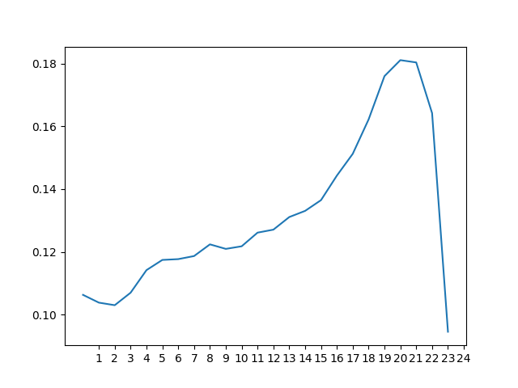
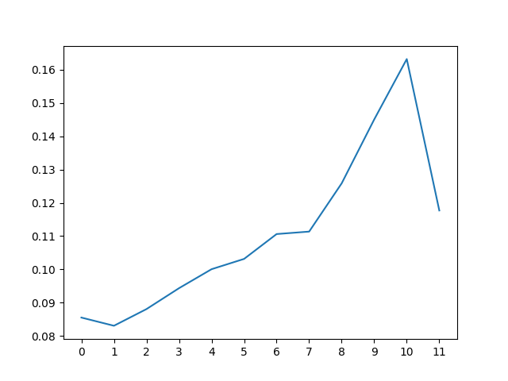
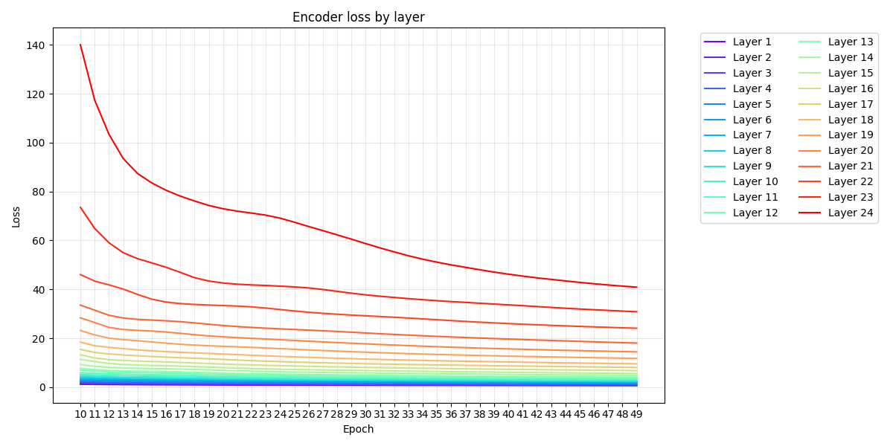

##### 10/23/24
Cosine similarity has a weak correlation to semantic similarity, but look at the correlation of the cosine similarity of each pair of vectors per layer. This is for gpt2-medium. 
(I.e. `cos_sim(sentence1_acts[layer], sentence2_acts[layer]`)

Notice how weird that correlation is. Now look at gpt2-small.

Really similar!! This **suggests** some kind of property of the architecture.There's probably a **sweet spot** for representation. Again, cosine similarity sucks balls but the correlation is undeniable. Maybe the sweet spot for a learned similarity metric isn't the same as for cosine similarity, but the idea of there being a sweet spot is probably important.

**Should this guide our training?** One idea could be to have some kind of weighted cosine similarity informed by this data. Could a "learned mixture" do better than layer 10?

##### 10/25/24
It is *easier to learn autoencoders for residual activations on earlier layers*. In fact *the difficulty of learning layerwise autoencoders scales almost with their depth*

